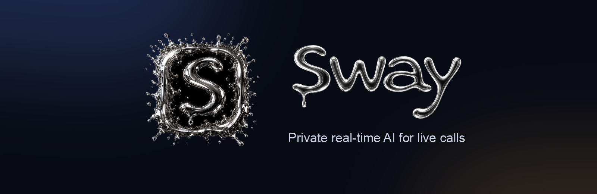

 

**An invisible AI assistant for your Mac.** 
Real-time help during sales calls, interviews, and meetings — no bot joins the call, and nobody else can see it.

 

---

### What Sway does

| | |
|---|---|
| 🎧 **Listen** &nbsp;`⌘E` | Transcribes both sides of a live call and surfaces suggestions as the conversation happens |
| 📸 **Capture** &nbsp;`⌘Q` | Snap your screen and get an instant answer about what's on it |
| 🎙️ **Talk** &nbsp;`⌘W` | Speak naturally — polished text lands wherever your cursor is |
| ⚡ **Use** &nbsp;`⌘R` | Drops the last answer straight into your notes, CRM, or editor |
| 🫥 **Stealth** &nbsp;`⌘T` | Hidden from screen sharing, so it stays yours |
| 📝 **Recap** | Notes, action items, and a follow-up draft when the call ends |

### Built for

**Sales calls** · **Recruiting screens** · **Customer success** · **Interviews** · **Stand-ups & reviews**

### Why it's different

- **No meeting bot.** Sway runs on your Mac — nothing joins Zoom, Meet, or Teams on your behalf.
- **Invisible on screen share.** The window is excluded from screen capture by design.
- **Native macOS.** Global shortcuts that work from any app, without stealing focus.

---

**macOS · launching soon** — join the waitlist at **[swayon.app](https://swayon.app)**

Questions? <a href="mailto:hello@swayon.app">hello@swayon.app</a> · © 2026 Sway

